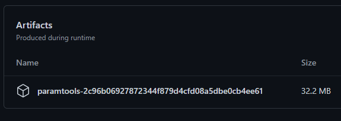

# paramtools

paramtools is a CLI utility that provides a set of commands for working with FROM Software PARAM files.

## Installation 

An installer is not provided. Binaries can be downloaded from the builds produced by GitHub actions.

To find the latest installer click the top result on the [GitHub Actions page](https://github.com/garyttierney/paramtools/actions?query=branch%3Amaster+is%3Asuccess)
and download the attached file under artifacts.

For example:



The zip file contains the paramtools.exe binary which is what you will interact with via a terminal or Windows CMD.

## Supported games and formats

This list is subject to change.

### Games

[x] - Dark Souls 3
[ ] - Dark Souls 2
[ ] - Dark Souls 1
[ ] - Sekiro

### Formats

[x] - Regulation file (Data1.bdt/parambnd)
[x] - Excel
[ ] - Csv
[x] - SQLite (partial, only writer support currrently)

## Available commands

### `paramtool convert`

The convert command reads PARAM files in one format and converts it to another. For example, it can be used to convert
PARAM files from the regulation file to an Excel file and back.

#### Options

| Name                | Description                                                                  |
| ------------------- | ---------------------------------------------------------------------------- |
| --input-format      | The format describing the input file (regulation, excel)                     |
| --input-path        | Path to the input file.                                                      |
| --output-format     | The format describing the output file (regulation, excel, sqlite)            |
| --output-path       | Path to the output file.                                                     |
| --paramdex-path     | Path to the paramdex repository. This contains definitions of PARAM layouts. |

#### Examples

**Note**: these examples are run from the directory containing paramtools.exe and the default paramdex distribution. If you do not have the paramdex folder you can download it [here](https://github.com/soulsmods/paramdex).

##### Convert gameparam_dlc2.parambnd.dcx to Excel file

```powershell
> paramtools.exe convert --game DS3 \
    --input-path "F:/path/to/gameparam_dlc2.parambnd.dcx" --input-format regulation \
    --output-format excel --output-path "F:/path/to/output/params.xlsx" \
    --paramdex-path "res/paramdex"
```

##### Convert Excel file to gameparam_dlcc2.parambnd.dcx

**Note**: when converting back to a regulation file paramtools will only replace files that already exist in the BND.

```powershell
> paramtools.exe convert --game DS3 \
    --input-format excel --input-path "F:/path/to/input/params.xlsx" \
    --output-path "F:/path/to/gameparam_dlc2.parambnd.dcx" --output-format regulation \
    --paramdex-path "res/paramdex"
```
